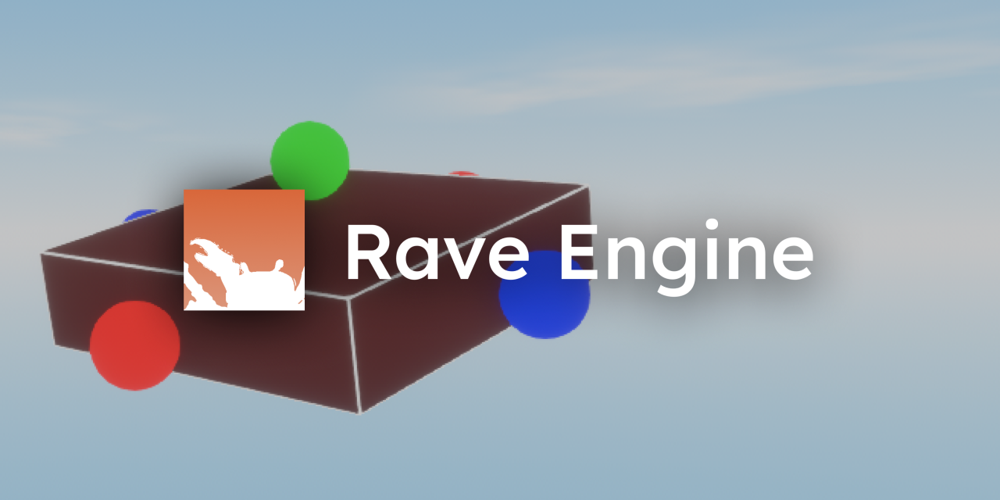

# RaveEngine-Game

Welcome to the RaveEngine project, a full rewrite of the previous client built in Godot to transition to Rust. RaveEngine is an engine built with Bevy, a graphics engine that allows us to skip the boring low-level part and get straight to what's important: the studio, the client and the server.

With Rust, we are able to build things we previously considered impossible or too hard with Godot. Many Godot features limited us for what we actually wanted with VERTEXIA. So, with the VERTIGO project (a rewrite of the website to Go), we thought, "why not rewrite the client too?". After all, it was getting hard to move around the client source code: it was as much of a mess as you think it was.

## Building

Building and running RaveEngine is fairly easy.

Head to the Rust website to install Rust and its tools:

https://rust-lang.org/tools/install/

Clone our repo, run `cargo build` (`cargo build` builds as debug, which is faster but may run worse and leave a bigger footprint in the disk; compile with the flag `--release` for a smaller file but longer compilation time), and **copy the `assets` folder you'll find the root of the project and paste it in `/target/[...]/`**. THIS IS A VERY IMPORTANT STEP!

You can now launch the executable!

As of right now, only the studio can be built, as work on client & server has not yet begun. I wanna first stabilize the studio and get it to a "proper" point before starting out with the client. 

## Designer Program

At some point, the client will work closely with the "RaveEngine-Creative" program. This allows our staff to easily develop UI without having to code it manually (this will be done only for the studio and bits of the client).

You may need to learn how .VUIS files are handled. The repo is [here](https://github.com/VertexiaGame/RaveEngine-Creative)

